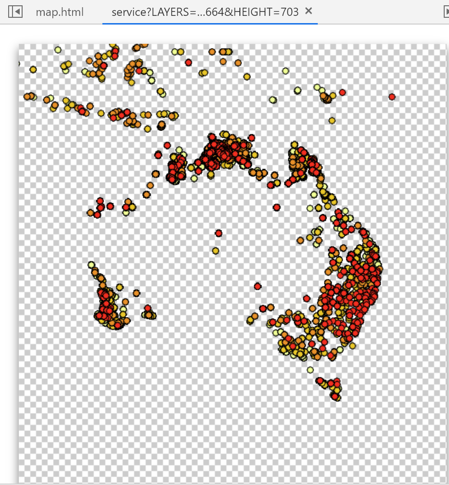

# Final Essay: Web-Map on Australia's Bushfires

link: https://myfirewatch.landgate.wa.gov.au/map.html

# Introduction

For my essay I decided to take a look at a web-map about the bushfires in Australia. I decided to do this because of the recent issues that Australia had with its wildfires and thought that there would be a lot of information on the topic. The goal of this project is to record the fires as they are happening so that there is awareness not only for the general public so that they can take precautions in relation to the fires but also for groups like fire fighters so they can know where the fires are and can try to combat them. Since this platform has such up-to-date information its major functions are being able to look at the fires between the last 0-72 hours from satellite imagery. That is the information that is going to be most useful for its target audiences. The people who have created this map are the people of the Landgate Imagery team. Landgate is “Western Australia's land information authority” they are the ones who are providing the satellite imagery and evaluation for the project.

# System Architecture

- **Client**: The web client of this map is the website called MyFireWatch, it is a website that records live and recent data about fires, it is focused mainly on Australia but has information for some of the nearby countries like Papua New Guinea and Indonesia.
- **Server**: The server for this web-map is the MyFireWatch website. That is where all the data is stored and compiled. They also use MapProxy which is a open source tile server for the map tiles of their map.
- **Services**: FireWatch is a set of fire monitoring products, services and solutions developed by Landgate Imagery. “FireWatch uses satellite imagery to detect and report on hotspots as they are observed and monitor their subsequent effect on the land”. This information was taken from their website.
- **Data**: The data for this webmap comes from Landgate and their satellite imagery. Other data comes from google and their online web services.

> View of the folders in the web-map

# Code

**Note**: A lot of their code is hard to read because it has no structure to it.

A List of the libraries, languages and more used for the project:
- HTML (holds the major code for the documents of the web-map like JS to be displayed on the web)
- jQuery (is a Javascript library that allows for easy manipulation and transversal of the things like HTML documents)
- CSS (is the stylesheet language used for the presentation of the web-map)
- OpenLayers (JavaScript library used for displaying map data on the web)
- API library for the Google Cloud Platform
- MapProxy (which is an open source tile server, so it stores the different tiles for the map)
- JavaScript (holds much of the code for the web map)

The flow between the client and the server in this case is that the client (FireWatch) holds most of the data provided by Landgate and then the web based languages like jQuery, HTML, CSS, etc. allow for the data to be moved onto the server for the public to be able to see. Some of the aspects of the web-map are already on the internet though and do not need that translation onto the web but rather just need to be called correctly to be used on the map. Like the basemap from Google maps and other Google based information.
As for the responsive design of that map it does support responsive design, the view from the phone, tablet, whatever device it might be is not bad and in some aspects is actually better than the response on the computer. For example it is easier to click is easier on the data points of the phone, tablet, etc. than it is on the computer but on the other devices the legend for what the different data layers are and represent is not even visible whereas they are visible on the computer, that being a big downside to the responsive design of this web map. The only device besides a computer that it shows the legend on is the iPad Pro.

> iPad view of the responsive design

> Computer view of the web-map

# Data Sources

The data sources include the raster data from Landgate. This provides the information for the Hotspot data layers and allows you to view hotspots from the last 0-72 hours. For the map options layer the default, the baselayer, is the Google roadmap view. However there are also options for satellite view and greenness (vegetation view) the sources for these come from Landgate and Google Maps respectively. These layers are not updated as frequently as the hotspot data layers and are still being worked on. The next data layer is raster data that was derived from Landgate data called Burnt Areas. You can look at the burnt areas from this year, last year and two years ago, although this data is even less frequently updated than the map options, there being a possible delay of a month for this layer. The last layer of data is the lightning activity, this layer is also taken from the Landgate satellite imagery and displays any lightning activity for the last 24 hours, 24-48 hours, 48-72 hours. All the data layers consist of raster data because most are derived from the satellite imagery from Landgate, but although they are raster data in this case all the data is also static because they are snapshots of the data at a certain time. You can tell this by looking at the source code of the data. All of it is either under Gstatic (a service used by Google to hold static data) or you can see when you click on the data that it is a snapshot because it is an image. The function works so that when there is new data it is updated and then takes screenshots of the new data and moves the old data either to the next time frame or gets rid of it because it is outside of the 0-72 hour time frame.

> Static Google layer

> Static Google layer

> The index to find the snapshot

> Snapshot of one of the tile layers to create the map, using OpenLayer

# Features of the Map

- Basemap: Google roadmap view
- Thematic layers: Satellite view layer and greenness (vegetation) layer
- Interactive features: zoom, toggle to home view, click, allows you to view pop-ups with information about that data point, the different layers are available to turn on and off, ability to search a specific location, buttons
- Web-map elements: legend, scale (500 km), zoom function, home view

> Code snippet of button to toggle to Australia

> Code snippet of search bar function

# Strengths vs. Weaknesses
| **Strengths**                    | **Weaknesses**                 |
| ------------------------------ | ------------------------- |
| Easily understandable map, the features are easy to intuitively understand what is happening on the map and how to use it | The pop-up features on the map are hard to click |
| Good basemap use since it is map that most people recognize it gives the map a sense of understanding and familiarity | The map does not allow you to move around easily because there is no drag feature so in order to closely examine part of the map you have to zoom in and out |
| The data for the hotspots is updated several times a day | They have disclaimers that the data might not be completely accurate because if there is smoke coverage the satellite imagery might not be able to detect the hotspots |
| The search feature makes it easy to know if your area/town/city has been affected | The data for the burnt area can have an update delay of a month |
| The disclaimer information about the data and map is obvious and easy to view | The map options vegetation layer uses purple and blue to represent dense vegetation which can be confusing |

# Reflection
For me this map needs some work, although it provides essentially what is promised there are many parts of the map that they plainly say need work or are obviously delayed in obtaining the data. There is a disclaimer before you enter the map telling you what exactly you should expect to get from the map (part of it telling you that this data should not be used for the active fires and that it does not represent all hotspots because some can be obscured by smoke) and on the map telling you that you should not use it “for the preservation of life or property”. I think this turns the map from a useful tool for the general public and emergency responders into a somewhat unreliable tool for everyone. I believe that there needs to be better maintenance of the map in order for it to be more useful. Especially because when I looked up maps of the fires in Australia there were other sites using this map to display the fires. So although there are disclaimers of what exactly the map entails I think that for the safety of everyone in Australia it needs to collect and maintain its data better.

One thing that I think is difficult about this web-map and every web-map is that if somebody does not have access to the internet then they are not capable of viewing this information. This issue would be especially bad for people whose communities are largely impacted by these fires since the point of this map is for the general public it would be sad if the people it was meant for were not even able to have access to it. Besides the satellite imagery that Landgate uses to gather data they also use ORION-ME which are monitors on the ground that assist them to collect the data as well. This is probably the biggest issue of “surveillance” for this map. But I wouldn’t even consider it because from what I could tell they are sensors and nothing more. As for power relations I am sure that this project is underfunded causing the issues that it has. Obviously there should be more money going towards this project because it seems to be one of the only groups that is trying to map the fires in Australia. Something that we know has been a big issue for them in the past and I am sure will continue to be an issue.
